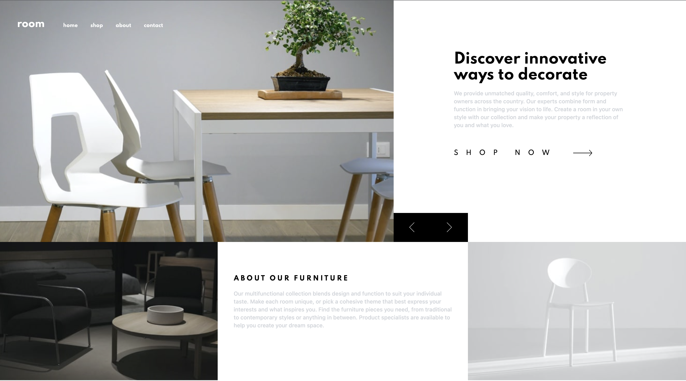
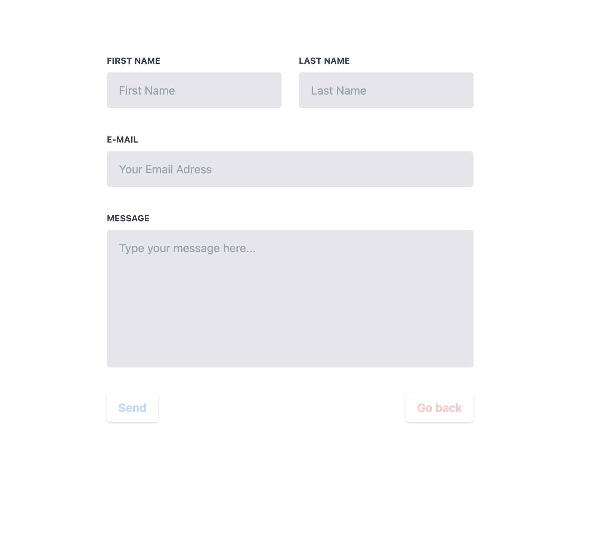
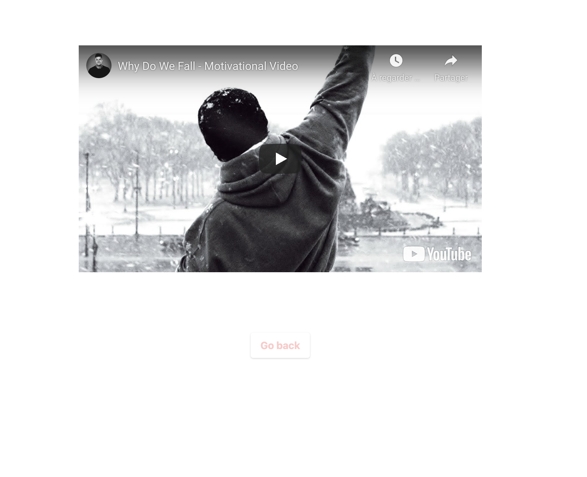
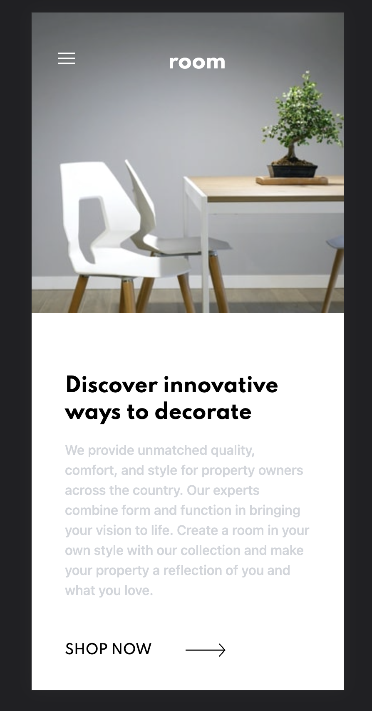
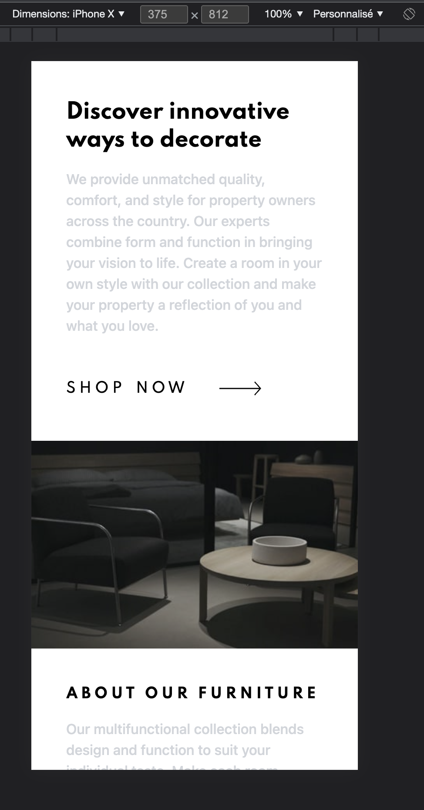
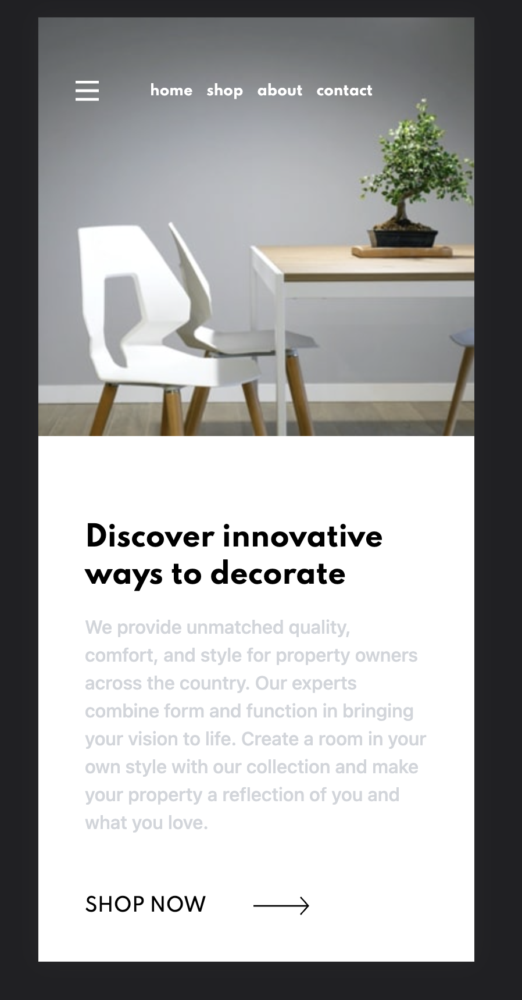

# Frontend Mentor - Room homepage solution

This is a solution to the [Room homepage challenge on Frontend Mentor](https://www.frontendmentor.io/challenges/room-homepage-BtdBY_ENq). Frontend Mentor challenges help you improve your coding skills by building realistic projects. 

## Table of contents

- [Overview](#overview)
  - [Screenshot](#screenshot)
  - [Links](#links)
- [My process](#my-process)
  - [Built with](#built-with)
  - [What I learned](#what-i-learned)
  - [Continued development](#continued-development)
  - [Useful resources](#useful-resources)
- [Author](#author)

## Overview

### Screenshot

Capture d'ecran du projet vue desktop :



Capture d'ecran vue desktop dans le forms :



Capture d'ecran vue desktop dans la video Youtube :



Capture d'ecran vue mobile 







## Links

- Live Site URL: [Add live site URL here](https://github.com/MathisFayet/MathisFayet.github.io)

## My process

### Built with

- Mobile-first workflow
- [React](https://reactjs.org/) - JS library
- CSS custom properties
- [Tailwind] - Css framework 
- [Styled Components](https://styled-components.com/) - For styles
- Flexbox

### What I learned

Implementer une video youtube avec React pour effectuer la lecture dans une autre page

```js
    <>
      <div className=" justify-center flex mt-24">
        <ReactPlayer url="https://youtu.be/mgmVOuLgFB0"/>
      </div>
      <div className="justify-center flex mt-24">
        <button onClick={navigateHome} className="shadow text-red-200 hover:text-red-300 font-bold py-2 px-4 rounded" type="button">Go back</button>
      </div>
    </>
```

Faire une ternaire pour quand mon icon est ouverte, cacher mon titre et afficher d'autre élement par-dessus

```js
    <ContainerImage className="">
            {
                isOpen ?
                    <div className="position: absolute">
                        <div className="flex mt-14">
                            <h1 onClick={navigateVideo} className="font-spartan cursor-default	hover:text-yellow-400 font-bold text-white text-xs mr-3 ml-24">home</h1>
                            <h1 onClick={navigateForms} className="font-spartan cursor-default	hover:text-green-400 font-bold text-white text-xs mr-3">shop</h1>
                            <h1 onClick={navigateVideo} className="font-spartan cursor-default	hover:text-red-400 font-bold text-white text-xs mr-3">about</h1>
                            <h1 onClick={navigateForms} className="font-spartan cursor-default	hover:text-blue-400 font-bold text-white text-xs">contact</h1>
                        </div>
                    </div>
                : null
            } 
        <ContainerTitle>
            <h1 className={`font-spartan text-2xl text-white font-bold mt-3 ml-28 ${isOpen ? 'hidden' : ''}`}>room</h1>
        </ContainerTitle>
    <ContainerImage>
```

### Continued development

- Le carousel d'image sur des images de background j'aimerai maîtriser ça, le responsive aussi, qui est trés important dans le développement de site internet.

### Useful resources

[https://tailwindcss.com/docs/installation] C'est le site de la doc tailwind, j'utilise tout le temps tailwind et sa documentation est complète.

Pour ce qui est du React je regarde souvent la documentation, je regarde plus des vidéos youtube.

## Author

- Website - [MathisFayet](https://www.your-site.com)
- LinkedIn - [MathisFayet](https://www.linkedin.com/in/mathis-fayet-6696881a0/)
